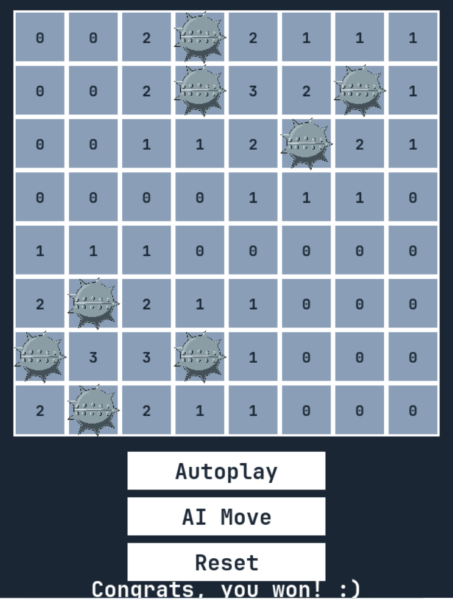

# Automated Minesweeper player - Mini proect WS22/23
### For the lecture Introduction to Artificial Intelligence at the University of Klagenfurt

Within this project, you can play a game of minesweeper with an AI assistant to help you avoid all the mines!

 Artificial intelligence (AI) is a hot topic nowadays and one of the areas where its advancements will define our future. Generating robust algorithms in AI, especially for complex problems, is essential. These robust algorithms are best tested on settings that are easy to interpret and understand in terms of space and time complexity. 
As part of the Introduction to AI course project at Klagenfurt University, the main task was to build a Minesweeper automated game with a search algorithms to apply the theoretical understanding of AI algorithms to a relatively simple game. 

The goal of the single-player logic-based computer game Minesweeper, which is played on a rectangular board, is to find as many randomly placed "mines" as you can in the lowest amount of time by clicking on "safe" squares and avoiding the mine-filled squares. The uncovered squares indicate the number of adjacent mines, where "adjacent" can mean horizontally, vertically, or diagonally adjacent. The game is over if the player clicks on a mine. To win this game the goal is to open all non-mine cells without opening a mine.

This implementation is done by using **Propositional Logic** and *added knowledge* to deduce whether a cell is *safe* or not. With each step made as the game progresses, more information is gathered, and the AI tries to determine the state of the cells.

## Implementation: 
In this project, following features were also implemented:
- **Autoplay Button:** When you click on this Button, the game will start by first making random moves and then choose safe moves due to the added knowledge wich gets more and more with each move.
- **AI Move Button:** When you clock on this Button, the AI-agent will help you with your next move when you are not sure about it. 
- **Reset Button:** When you click on this Button, you can reset your game and start from the beginning.

 

Preview implemented Game

